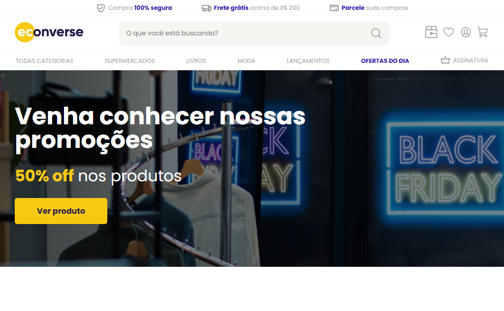

# 💻 Teste Vaga Front End Jr
Projeto desenvolvido como parte do **Teste Técnico** da empresa **Econverse** para a vaga de **Desenvolvedor Front End Jr (E-commerce)**.

## 📸 Captura de Tela


## 🚀 Tecnologias Utilizadas
<p align="left">
    
    
    
    
    
</p>

## 📚 Funcionalidades Implementadas
- Banner Principal
- Boas Práticas de Acessibilidade (SEO)
- Componentização em React
- Estruturação Semântica (HTML)
- Header Completo (Topo + Principal + Navegação)

## ▶️ Como Rodar o Projeto
Siga os passos abaixo para rodar a aplicação localmente:

1. **Clone esse repositório:**

   ```
   git clone https://github.com/jonatasoliveiradasilva/teste-front-end
   cd teste-front-end
2. **Instale as dependências:**

   ```
   npm install
3. **Inicie o servidor de desenvolvimento:**

   ```
   npm run dev   
**Acesse a aplicação no navegador:** http://localhost:5173/

## 📌 Considerações Finais
- Mesmo não estando 100% finalizado o projeto foi desenvolvido com foco em boas práticas, organização e semântica.
- Estou em constante aprendizado/evolução e aberto a feedbacks 🚀
